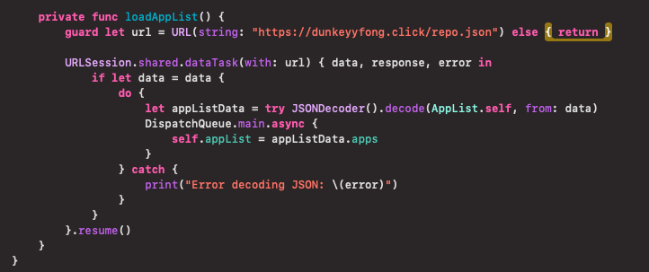
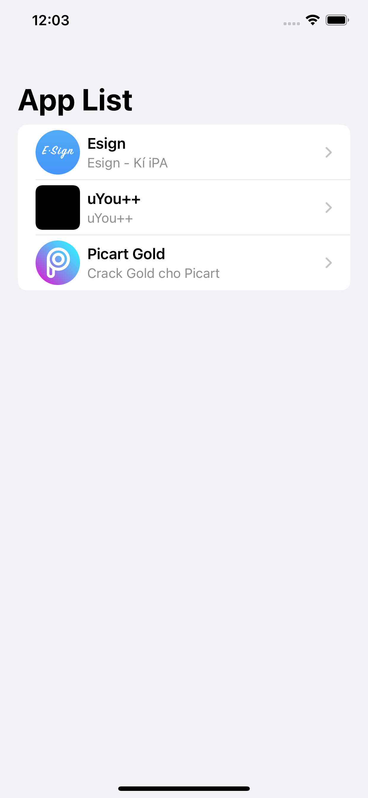
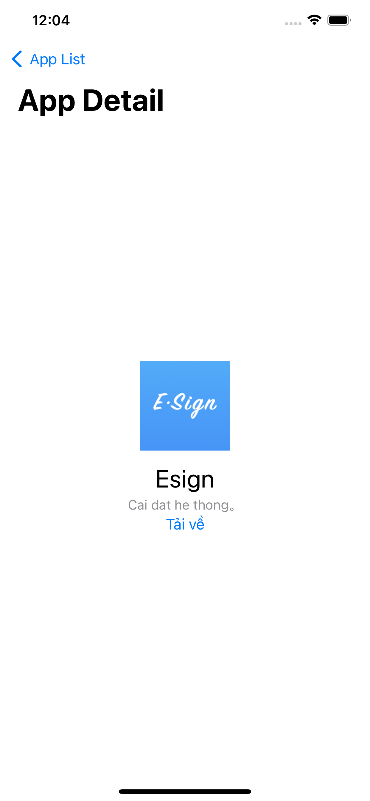

# Source code receives Json API for iPA

<p>
This is a project that I am working on, it will be something that can help you when you want to create an application that receives json to receive information like "nameApp",...
</p>

## Here's how to use it:


<br>
<br>

```Swift
guard let url = URL(string: "https://dunkeyyfong.click/repo.json") else { return }
```

<p>With this project, I have not integrated other API sources but I have integrated them into the code as you can see in the Screenshot image.</p>


## Some notes that you need to know
<ul>
    <li>You need to change the url inside the code for the app to run.</li>
    <li>The apps will have to manually sign and paste the link into the api json file, or you can paste the ipa download link yourself.</li>
</ul>

## Screenshot

<div style="display: flex; padding: 10px">
    
    
</div>
